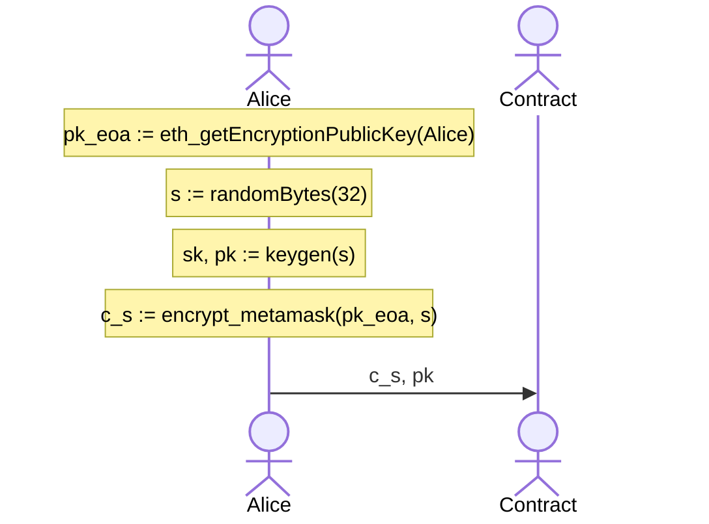
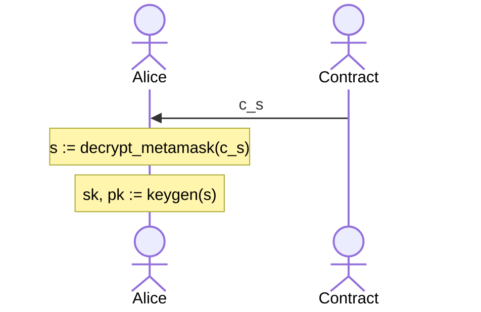
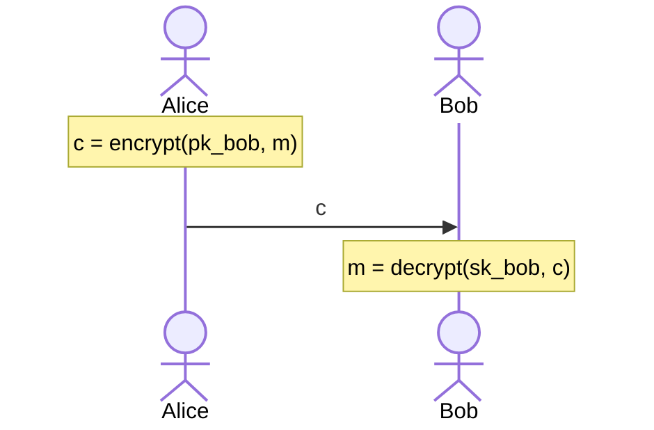

# Blockchattin

**A decentralized chatting application where each message is a transaction**.

Obviously made for educational purposes, the gas fees are too high and notably unreasonable to be used for chatting. It uses the Rinkeby test network. Note that the messages themselves can be read in the transaction details on etherscan.

Contract address: [0x2304BBd56A0fBCBDb417522fA8fB2EAdCf64E3E4](https://rinkeby.etherscan.io/address/0x2304BBd56A0fBCBDb417522fA8fB2EAdCf64E3E4)

## Peer-to-Peer Chatting

Although a [deprecated functionality of MetaMask](https://medium.com/metamask/metamask-api-method-deprecation-2b0564a84686), this application uses [`eth_decrypt`](https://docs.metamask.io/guide/rpc-api.html#eth-decrypt-deprecated) and [`eth_getEncryptionPublicKey`](https://docs.metamask.io/guide/rpc-api.html#eth-getencryptionpublickey-deprecated) to use asymmetric encryption for the messages. ([see also](https://betterprogramming.pub/exchanging-encrypted-data-on-blockchain-using-metamask-a2e65a9a896c))

There are two drawbacks to these functions:

1. `eth_decrypt` and `eth_getEncryptionPublicKey` asks for user input everytime it is called.
2. Encryption is done for UTF-8 only.

So, EOA keypair will not be used for chatting per se. Instead, the user will generate a random 32-byte secret which will then be used to generate a key-pair to be used in chatting only. On first use, the user will encrypt this secret with their own EOA public key (via MetaMask RPC). We use [eciejs](https://ecies.org/js/) for this.

### Initial Setup

The first time a user starts the application a keypair is generated to be used for chatting alone, and the secret to generate this keypair is encrypted with EOA public key. These are stored in the smart contract:

On later launches, the secret is queried from the contract and that same keypair is generated:

This way, Alice can use her private key `sk` without exposing it.

### Messaging

As we have shown above, the users provide their chatting public key at first setup. If we want to send a message to someone, we use their public key `pk` to encrypt our message, and they will decrypt it with their secret key `sk` to read it.

## Aliases

Normally, messaging is done via addresses but users can buy Aliases too. The `price` is 0 for all aliases by default. A `fee` is taken from each purchase by the contract. So, to purchase an alias, users must pay at least `fee + price`:

1. Alice buys **cats** alias for `fee + 1` ether.
2. The `price` of **cats** is now `1`.
3. Bob would like to buy **cats**, so he sends `fee + 2` to buy it.
4. Alice is paid back `1` ether from her first purchase.

The refunds are done via [PullPayment](https://docs.openzeppelin.com/contracts/2.x/api/payment#PullPayment). Note that Alice can also refund **cats** to get back her `1` ether; but the `fee` stays with the contract.

## TODO

- Add friends list to local storage.
