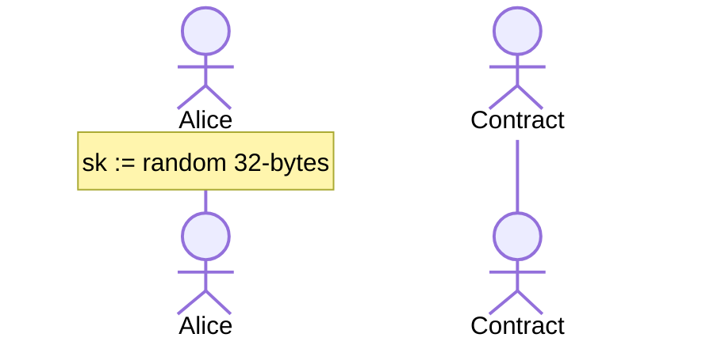

# Blockchattin

**A decentralized chatting application where each message is a transaction**.

Obviously made for educational purposes, the gas fees are too high and notably unreasonable to be used for chatting. It uses the Rinkeby test network. Note that the messages themselves can be read in the transaction details on etherscan.

Contract address: [0x2304BBd56A0fBCBDb417522fA8fB2EAdCf64E3E4](https://rinkeby.etherscan.io/address/0x2304BBd56A0fBCBDb417522fA8fB2EAdCf64E3E4)

## Peer-to-Peer Chatting

Although a [deprecated functionality of MetaMask](https://medium.com/metamask/metamask-api-method-deprecation-2b0564a84686), this application uses [`eth_decrypt`](https://docs.metamask.io/guide/rpc-api.html#eth-decrypt-deprecated) and [`eth_getEncryptionPublicKey`](https://docs.metamask.io/guide/rpc-api.html#eth-getencryptionpublickey-deprecated) to use asymmetric encryption for the messages. See [this guide](https://betterprogramming.pub/exchanging-encrypted-data-on-blockchain-using-metamask-a2e65a9a896c) on how to use them.

There are two drawbacks to these functions:

1. `eth_decrypt` asks for user input everytime it is called.
2. Encryption is done for UTF-8 only.

So, EOA keypair will not be used for chatting per se. Instead, these keys will be used to generate a mnemonic, which will be used to generate key pairs.

### Initial Setup

When a user starts using the chatting application, the following takes place:

## Aliases

Normally, messaging is done via addresses but users can buy Aliases too. An alias price is defined as `baseFee + lastAliasPrice`. For example:

1. Alice buys `cats1` alias for `baseFee + 0` ether. Upon purchase, `cats1` maps to Alice's address and vice versa.
2. The `lastAliasPrice` of `cats1` is now `baseFee`.
3. Bob would like to buy `cats1`, so he sends `baseFee + baseFee` to buy it.
4. Alice can withdraw `baseFee` (which was the `lastAliasPrice` when Bob bought `cats1`).

In the least-costly scenario, the prices are multiples of `baseFee`, but a user can pay much more for their alias if they wanted to. If someone else buys their Alias, they will get their money back with amount of `lastAliasPrice` they have set during their purchase.
